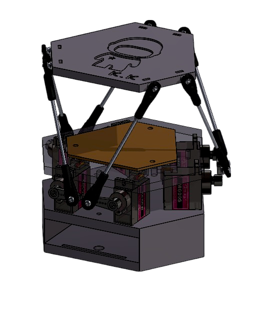

<h1 align="center">6-DOF Mini Flight Simulator</h1>

##### 
 Ever wondered how theme park rides or flight simulators make your body feel like you're moving, even when you're not?

  
 This mini Stewart platform is a scaled-down, servo-powered replica designed to recreate that same sensation! Just like the full-size flight simulator we've been building at Uni.
  

  

  

  
#### Stewart Platform SOLIDWORKS Drawing:

# How it works:
🔁 Smooth motion control: Servo motors use Lerp functions to match real movement ranges from our SolidWorks simulation.

⏱️ Timing-based movement: Every 500ms, the platform shifts through heave positions up, center, and down for a total of 2 seconds.

🎯 Full motion cycle: Then it glides through a 12-second loop of:
→ sway, surge, heave, pitch, roll, and yaw

🛠️ Auto-adjusts for clarity: If the movements feel too subtle, the code automatically recalibrates to make the motion more noticeable.

Tools: SolidWorks, Arduino, Fabrication
  

## Demo Videos  

##### 🎮 POV: Mini Stewart Platform in Action -> Click To Watch!

  

 

##### 🎥 Stewart Platform Self Demo -> Click To Watch!

  

   
#### 📄 LICENSE INFO 
This source code is available for viewing only. Usage of the code in any form is prohibited without explicit permission. Please refer to the LICENSE file for more details.
